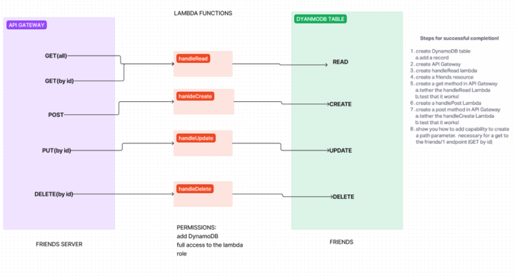

# Project: Serverless API

# Author: Kao Saelor

## Problem Domain: Create a serverless REST API

### Feature Tasks & Requirements

Create a single resource REST API using a domain model of your choosing, constructed using AWS Cloud Services.

- Database: DynamoDB
  - 1 Table required.

- Routing: API Gateway
  - POST
  - /people - Given a JSON body, inserts a record into the database.
  - returns an object representing one record, by its id (##).
  - GET
    - /people - returns an array of objects representing the records in the database.
    - /people/## - returns an object representing one record, by its id (##).
  - PUT
    - /people/## - Given a JSON body and an ID (##), updates a record in the database.
    - returns an object representing one record, by its id (##).
  - DELETE
    - /people/## - Given an id (##) removes the matching record from the database.
    - returns an empty object.

- CRUD Operation Handlers: Lambda Functions.

## Documentation

**- What is the root URL to your API?**

- My [API](https://85snlf1dy1.execute-api.us-west-2.amazonaws.com/friend)

**- What are the routes?**

- GET : `/people` - grab all people in DB
- GET : `/people/##` - grab one person from DB by ID
- POST : `/people` - create new person into DB
- PUT : `/people/##` - update a person in DB by ID
- DELETE : `/people/##` - delete person in DB by ID

**- What inputs do they require?**

- For the GET (singular), PUT, and DELETE operations to work, you need to provide an ID when using the API gateway.

**- What output do they return?**

- GET shows id and name(s), POST adds a person with id and name, PUT updates a person's name by id, DELETE removes by id.

## Collaborators

- Ryan Gallaway, Code Fellow Instuctor
- Kenya Womack
- Coriana Willams

## UML




## Notes

Creating a serverless API: Checklist

- [ ] IAM User role with access to Lambda and DynamoDB Full Access
- [ ] Dynamo DB Table Created
- [ ] Lambda function(s) that use Dynamoose to attach to the table
  - [ ] Created with the correct IAM Role (Step 1)
- [ ] API Endpoints that all the appropriate functions for each action type

### Creating a Dynamo DB Table at AWS

1. Open the DynamoDB Dashboard
1. Choose `Create Table`
1. Name your table
1. Choose a field name to use as primary key
   - Generally, "id", and you'll need to supply this when you add records

### Working with Dynamo from Node

When writing code that connects to a Dynamo Database, you'll need to know your AWS credentials and install `dynamoose` as a dependency

<https://dynamoosejs.com/getting_started/Introduction>

#### Create a Schema with Dynamoose

This is just like Mongoose!

```javascript
'use strict';

const dynamoose = require('dynamoose');

const friendsSchema = new dynamoose.Schema({
  'id': String,
  'name': String,
  'phone': String,
});

module.exports = dynamoose.model('friends', friendsSchema);
```

#### Write your Lambda Function (or any JS) to use your schema...

> Be sure your Lambda function has full permissions for API Gateway, DynamoDB, and Cloudwatch

The actul schema and CRUD ops are very similar Mongoose and MongoDB

```javascript
const contentModel = require('./friends.schema.js');

async function findRecord(id) {
  const content = await contentModel.query("id").eq(id).exec();
  console.log(content[0]);
}

async function saveRecord(name, phone) {
  const id = uuid();
  const record = new contentModel({ id, name, phone });
  const data = await record.save();
  console.log(data);
}

```

### Create API Endpoints

1. At API Gateway, create a new HTTP API
1. Identify "Integrations" which is one or more of your Lambda functions (above)
1. Once created, define a route endpoint for each REST method
1. Connect each endpoint to the correct lambda

As your routes are invoked by users, those lambda's will fire, with the `event` receiving any POST or QUERY data
